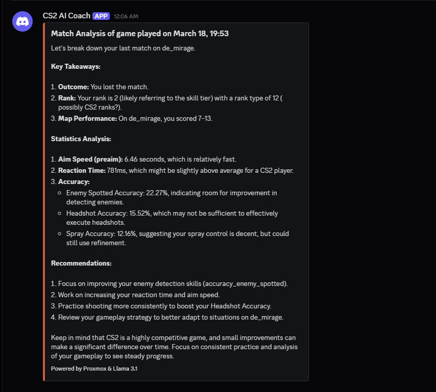

# leetify-ai-coach

## An automated performance analysis pipeline that turns CS2 match data into actionable AI coaching.

### Overview

This project is a DevOps-focused automation tool designed to bridge the gap between raw match statistics and actual skill improvement. It monitors a player's Leetify profile, detects new matches, and uses a Large Language Model (LLM) to provide personalized, constructive feedback delivered directly to Discord.
### Tech Stack

    Language: Python 3.x

    Data Source: Leetify Public API

    Intelligence: Self hosted Ollama LLM instance

    Delivery: Discord Webhooks

    Infrastructure: Containerized execution via Docker on a Proxmox LXC node, orchestrated by GitHub Actions self-hosted runners.

### Key Features

    Automated Polling: Periodically checks for new match uploads.

    Smart Analysis: Leverages a local LLM (Llama 3.1) to perform context-aware analysis on raw JSON match telemetry provided by the Leetify API.

    Instant Feedback: Sends a formatted summary and ways to improve to a private Discord channel.

### Project details

#### Operational Workflow

The system is designed as a decoupled, event-driven pipeline:

1. Continuous Integration (CI):

   - Upon a code push, a GitHub Action builds the environment into a Docker image and pushes it to the GitHub Container Registry (GHCR). This ensures the deployment environment is immutable and version-controlled.

2. Scheduled Execution (CD):

   - A secondary workflow triggers every 30 minutes via Cron. It dispatches the workload to a Self-Hosted Runner on a private Proxmox node.
   - This runner injects Repository Secrets (API keys, Steam IDs) into the container environment at runtime for maximum security.

3. Stateful Logic & Resource Optimization:

   - The Python script uses a modular functional design. On startup, it performs a State Check: comparing the latest Match ID from the Leetify API against a local state.json.

   - If no new match is found, the process terminates immediately, preventing redundant LLM inference and saving system resources.

4. Inference & Delivery:

   - When a new match is detected, the script extracts key telemetry and constructs a structured prompt for the local Ollama (Llama 3.1 8B) instance.

   - The AI-generated coaching advice is then dispatched via a Discord Webhook, providing the player with an immediate post-match debrief.

5. Persistence:

   - The container is ephemeral and destroyed after each run (--rm). However, match history is preserved via a Docker Volume Mount, ensuring the state.json persists on the Proxmox host.

Example discord webhook of the AI coach feedback



###  Environment Variables
To run this pipeline, the following GitHub Secrets must be configured:

- ```STEAM_ID```: Your 64-bit Steam ID used to identify your matches in the Leetify API.

- ```LEETIFY_URL```: The specific API endpoint used to pull your match telemetry.

- ```LLM_URL```: The connection string or IP address for your local Ollama instance.

- ```WEBHOOK_URL```: Your private Discord Channel Webhook URL for receiving coach reports.

- ```STATE_FILE```: Set to /app/state.json to ensure the script maps correctly to the Docker volume.


### Future Roadmap
- [ ] Implement `keep_alive: 0` for LLM inference to optimize host RAM usage.
- [ ] Add Prometheus metrics to track "Coaching Success Rate."
- [ ] Support for multiple players via a shared database backend.